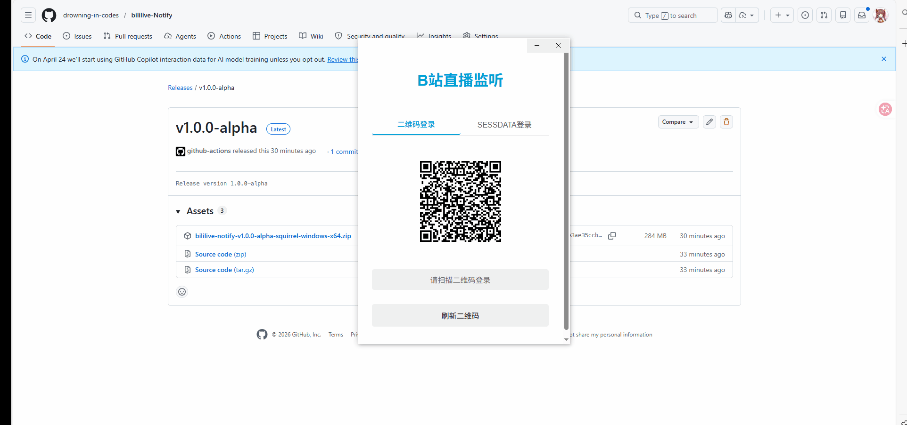

# bililive-Notify

桌面端 B 站直播监听工具，基于 Electron 构建。支持二维码登录或手动填写 SESSDATA 登录，查看账号信息、关注分组、正在直播列表，并维护独立的监听名单。


An Electron-based desktop app for monitoring Bilibili live streams. It supports QR-code login or manual SESSDATA login, shows account info and follow groups, lists currently live followed creators, and maintains a separate monitoring list.


## 功能 Features

- 二维码登录 / SESSDATA 登录
- 查看账号信息：昵称、性别、会员等级、硬币数
- 查看关注分组、特别关注和正在直播列表
- 按用户名搜索用户并一键关注
- 维护独立的监听列表，支持添加和移除
- 登录状态持久化，支持关闭确认与托盘驻留
- API 缓存，减少重复请求

- QR-code login / SESSDATA login
- View account info: nickname, gender, level, and coins
- Browse follow groups, special follows, and currently live creators
- Search users by name and follow them directly
- Maintain a separate monitoring list with add/remove actions
- Persist login state, tray behavior, and close preferences
- Cache API responses to reduce repeated requests

## 界面 Pages

- `login.html`：登录页，提供二维码登录和 SESSDATA 登录
- `index.html`：主界面，展示账号信息、监听列表与搜索入口
- `follow-list.html`：关注列表页，展示正在直播、特别关注和其他分组

## 运行 Requirements

- Node.js 16.4+（与 Electron Forge 依赖要求保持一致）
- npm
- 可访问 Bilibili 相关接口的网络环境

## 安装 Install

```bash
npm install
```

## 启动 Run

```bash
npm start
```

## 测试 Test

开发环境测试会以 `NODE_ENV=test` 启动 Electron：

```bash
npm test
```

## 使用说明 Usage

1. 启动应用后，如果本地没有有效登录信息，程序会进入登录页。
2. 你可以使用二维码登录，也可以手动输入 `SESSDATA` 登录。
3. 登录成功后会进入主界面，查看账号信息并管理监听列表。
4. 点击“关注列表”可打开完整的关注分组页面。
5. 在搜索框中输入用户名，可搜索用户并执行关注或加入监听。

1. After launch, the app opens the login page if no valid local session is found.
2. You can log in with a QR code or by entering `SESSDATA` manually.
3. After login, the main dashboard shows account info and the monitoring list.
4. Click “关注列表” to open the full follow-groups page.
5. Search by username to follow a user or add them to the monitoring list.

## 数据存储 Data Storage

应用会把登录与状态数据保存到 Electron 的用户数据目录中，主要包括：

- `cookies.json`：登录 cookie / session 数据
- `monitor-list.json`：按当前账号保存的监听名单
- `app-settings.json`：应用设置，例如关闭行为
- `api-cache.json`：接口缓存数据

The app stores login and state data in Electron's user data directory, including:

- `cookies.json`: login cookie/session data
- `monitor-list.json`: monitoring list scoped to the current account
- `app-settings.json`: app preferences such as close behavior
- `api-cache.json`: cached API responses

## 开发说明 Development Notes

- 主进程入口：`index.js`
- 预加载脚本：`preload.js`
- 渲染页样式：`index.css`、`login.css`、`follow-list.css`
- 当前仓库未配置打包脚本，默认通过 `electron .` 启动
- 如果需要排查启动问题，可使用 `npm test` 进入测试环境并自动打开 DevTools

- Main process entry: `index.js`
- Preload script: `preload.js`
- Renderer styles: `index.css`, `login.css`, and `follow-list.css`
- No packaging script is configured in this repository; the app starts with `electron .`
- Use `npm test` to start in test mode and open DevTools automatically for debugging

## 贡献 Contributing

欢迎提交改进建议和 PR。建议保持以下原则：

- 修改前先确认文档与代码行为一致
- 新增功能时同步更新 README 相关章节
- 尽量避免引入未验证的接口行为描述
- PR 描述中写清变更内容、验证方式和潜在影响

We welcome improvements and pull requests. Please keep these guidelines in mind:

- Confirm that documentation matches actual code behavior before editing
- Update the README whenever you add or change user-facing behavior
- Avoid documenting unverified API behavior
- Include change summary, validation steps, and potential impact in PR descriptions

## TODO

以下事项用于跟踪可迭代的功能与性能优化，使用复选框标记完成状态。

Feature Improvements

- [x] SESSDATA 获取指引弹窗（登录页问号按钮 + 说明窗口）
- [ ] 支持一键从浏览器导入 Cookie（降低手动复制 SESSDATA 成本）
- [ ] 监听列表分组与标签管理（按类别/优先级组织）
- [ ] 开播通知增强：自定义声音、频率限制、免打扰时段
- [ ] 通知历史记录页（查看最近开播提醒与点击跳转记录）
- [ ] 启动时自动恢复上次打开的子窗口（关注列表/帮助页）

Performance Improvements

- [ ] API 缓存分层与按接口细粒度过期策略（进一步减少重复请求）
- [ ] 并发请求限流与队列调度（避免短时请求峰值）
- [ ] 监听列表渲染优化（大列表场景下虚拟滚动/增量渲染）
- [ ] 轮询改造为可见性感知策略（窗口隐藏时降低轮询频率）
- [ ] 监控性能指标面板扩展（请求耗时、失败率、缓存命中率）
- [ ] 关键路径日志分级与采样（降低高频日志对 I/O 的影响）

Notes

- `[x]` 表示已完成并合入主分支
- `[ ]` 表示待完成或进行中

## License

ISC
